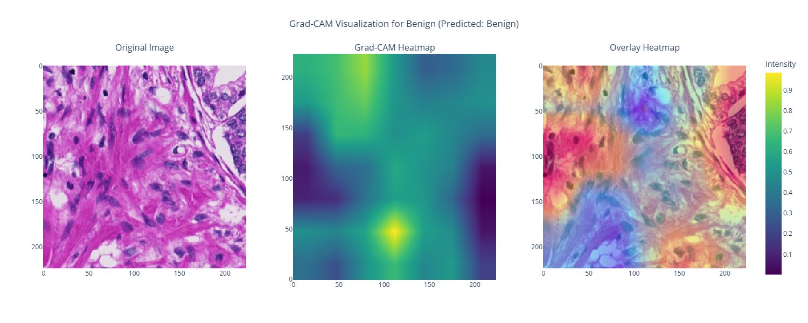

# Automated Gleason Scoring System

This project is an implementation of an automated Gleason scoring system using convolutional neural network (CNN) models, specifically **ResNet-50** and **EfficientNet**. The goal is to classify prostate tissue into Gleason scores, helping to improve the diagnosis of prostate cancer.

## Overview

### Models Used
- **ResNet-50**: This model achieved an impressive **97% accuracy** during testing, proving to be highly reliable in predicting Gleason grades.
- **EfficientNet**: This model achieved a **62% accuracy**, performing moderately well in comparison.

### Visualizations
Here are some visualizations to better understand the results:

#### Original and Augmented Images


#### Training Metrics for EfficientNet


#### Training Metrics for ResNet-50


#### Grad-CAM Visualizations
- **Benign Tissue**:
  
- **Gleason 3**:
  
- **Gleason 4**:
  
- **Gleason 5**:
  

#### Classification Metrics for ResNet-50


#### Misclassified Example


#### Confusion Matrix


## Dataset
The dataset contains **200 tissue microarray (TMA) images**, divided into training, validation, and testing sets in a **70:15:15** ratio. The images are categorized into the following classes:
- **Benign**
- **Gleason3**
- **Gleason4**
- **Gleason5**

## Methodology
1. **Data Preparation**
   - The dataset was divided into training, validation, and test sets.
   - Images were resized, normalized, and augmented to improve model performance.

2. **Model Training**
   - Models were trained using the PyTorch framework.
   - Techniques like dropout and learning rate scheduling were used to prevent overfitting and optimize performance.

3. **Visualization**
   - Grad-CAM was used to visualize the areas of tissue influencing the model’s predictions.

## Models
The repository includes the following saved PyTorch models:

1. **EfficientNet**:
   - Location: `models/efficientnet_best.pth`
   - Description: Trained EfficientNet model with a test accuracy of 62%.

2. **ResNet-50**:
   - Location: `models/resnet_best.pth`
   - Description: Trained ResNet-50 model with a test accuracy of 97%.

You can load these models for inference or further fine-tuning using the code below:

```python
import torch
from efficientnet_pytorch import EfficientNet
from torchvision.models import resnet50

# Load ResNet-50
resnet_model = resnet50(pretrained=False)
resnet_model.load_state_dict(torch.load("models/resnet_best.pth"))
resnet_model.eval()

# Load EfficientNet
efficientnet_model = EfficientNet.from_name("efficientnet-b0")
efficientnet_model.load_state_dict(torch.load("models/efficientnet_best.pth"))
efficientnet_model.eval()
```

## Results
- **ResNet-50** achieved a test accuracy of **97%**, making it a reliable choice for classification.
- **EfficientNet** achieved a test accuracy of **62%**, with potential for improvement.
- Grad-CAM visualizations effectively highlighted tumor regions in tissue samples.

## Future Work
- Expand the dataset to improve model generalization.
- Experiment with other CNN architectures like **DenseNet**.
- Develop ensemble models to boost overall performance.

## How to Use
1. Clone this repository:
   ```bash
   git clone https://github.com/yourusername/gleason-score-classifier.git
   ```

2. Install the required dependencies:
   ```bash
   pip install -r requirements.txt
   ```

3. Open and run the Jupyter Notebook for training and testing:
   ```bash
   jupyter notebook src/Gleason_Score_Classifier.ipynb
   ```

## License
This project is licensed under the MIT License. Feel free to use and modify the code as needed.

## Acknowledgments
- This implementation leverages the **PyTorch** framework.
- Grad-CAM visualizations were inspired by research on model interpretability.
